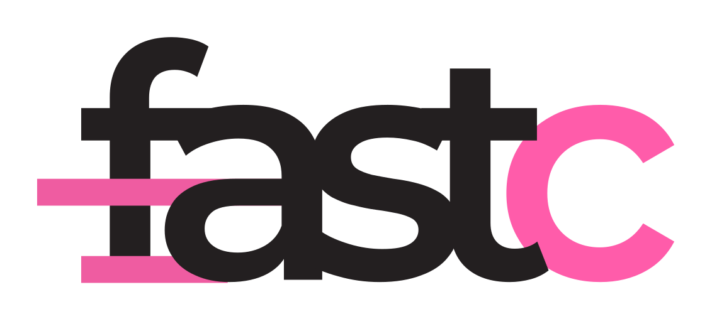

<p align="center">
    
<p>

<p align="center">
    <a href="https://pypi.python.org/pypi/fastc/"></a>
    <!-- <a href="https://github.com/EveripediaNetwork/fastc/releases"></a> -->
    <a href="https://github.com/EveripediaNetwork/fastc/blob/master/LICENSE"></a>
</p>


## Key features
- **Focused on CPU execution:** Use efficient models like `deepset/tinyroberta-6l-768d` for embedding generation.
- **Cosine Similarity Classification:** Instead of fine-tuning, classify texts using cosine similarity between class embedding centroids and text embeddings.
- **Efficient Multi-Classifier Execution:** Run multiple classifiers without extra overhead when using the same model for embeddings.


## Installation
```bash
pip install -U fastc
```

## Train a model
You can train a text classifier with just a few lines of code:
```python
from fastc import SentenceClassifier

tuples = [
    ("I just got a promotion! Feeling fantastic.", 0),
    ("Today was terrible. I lost my wallet and missed the bus.", 1),
    ("I had a great time with my friends at the party.", 0),
    ("I'm so frustrated with the traffic jam this morning.", 1),
    ("My vacation was wonderful and relaxing.", 0),
    ("I didn't get any sleep last night because of the noise.", 1),
    ("I'm so excited for the concert tonight!", 0),
    ("I'm disappointed with the service at the restaurant.", 1),
    ("The weather is beautiful and I enjoyed my walk.", 0),
    ("I had a bad day. Nothing went right.", 1),
    ("I'm thrilled to announce that we are expecting a baby!", 0),
    ("I feel so lonely and sad today.", 1),
    ("My team won the championship! We are the champions.", 0),
    ("I can't stand my job anymore, it's so stressful.", 1),
    ("I love spending time with my family during the holidays.", 0),
    ("My computer crashed and I lost all my work.", 1),
    ("I'm proud of my achievements this year.", 0),
    ("I'm exhausted and overwhelmed with everything.", 0),
]

classifier = SentenceClassifier(embeddings_model='microsoft/deberta-base')
classifier.load_dataset(tuples)
classifier.train()
```

## Export a model
After training, you can save the model for future use:
```python
classifier.save_model('./sentiment-classifier/')
```

## Publish model to HuggingFace
> [!IMPORTANT]  
> Log in to HuggingFace first with `huggingface-cli login`

```python
classifier.push_to_hub('brunneis/sentiment-classifier')
```

## Load an existing model
You can load a pre-trained model either from a directory or from HuggingFace:
```python
# From a directory
classifier = SentenceClassifier('./sentiment-classifier/')

# From HuggingFace
classifier = SentenceClassifier('brunneis/sentiment-classifier')
```

## Class prediction
```python
sentences = [
    'I am feeling well.',
    'I am in pain.',
]

# Single prediction
scores = classifier.predict_one(sentences[0])
print('positive' if scores[0] > .5 else 'negative')

# Batch predictions
scores_list = classifier.predict(sentences)
for scores in scores_list:
    print('positive' if scores[0] > .5 else 'negative')
```
